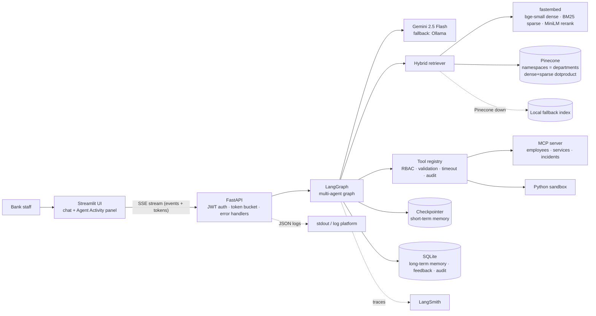
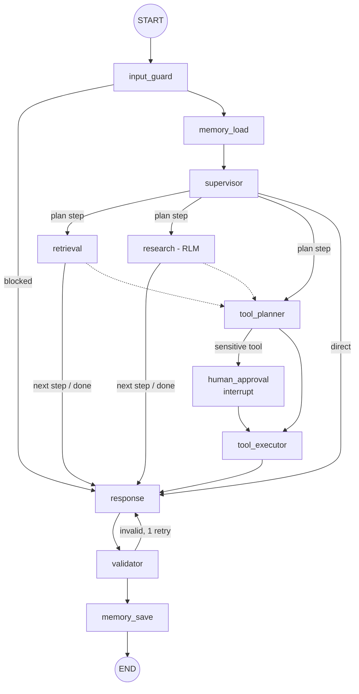
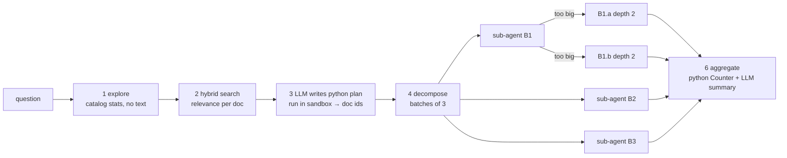

# Architecture

## 1. System view

## 2. LangGraph

The supervisor returns a plan of max 2 steps (for example `research` then `tools`). After each agent
`route_next()` moves to the next step, then to `response`.

## 3. RLM (research agent)

Each sub-agent retrieves only the **targeted sections** of its documents (hybrid search with a
`doc_id $in [...]` filter), never full documents. If the sections are larger than
`RLM_MAX_CHARS_PER_CALL`, the sub-agent splits the batch and calls itself (depth + 1, max `RLM_MAX_DEPTH`).

## 4. Retrieval

| Part | Choice | Why |
|---|---|---|
| Chunking | markdown headings, then 900 chars / 120 overlap | a section (e.g. "Root cause") stays together |
| Dense | `BAAI/bge-small-en-v1.5` (384) | free, CPU, good quality |
| Sparse | `Qdrant/bm25` | exact IDs (`INC-2026-0114`), product names |
| Store | Pinecone serverless, `dotproduct`, dense + sparse in one index | native hybrid query |
| Hybrid | `alpha * dense + (1 - alpha) * sparse_norm` (alpha 0.6) | scores shown in UI |
| Namespaces | one per department, queried in parallel with `asyncio.gather` | isolation + parallel |
| Filters | `access_level $in role_levels` always + type/department/date | RBAC at retrieval |
| Rerank | `ms-marco-MiniLM-L-6-v2` cross-encoder on top 15 | better top 6 |
| Attribution | doc_id, title, section, date, source path in metadata | citations |
